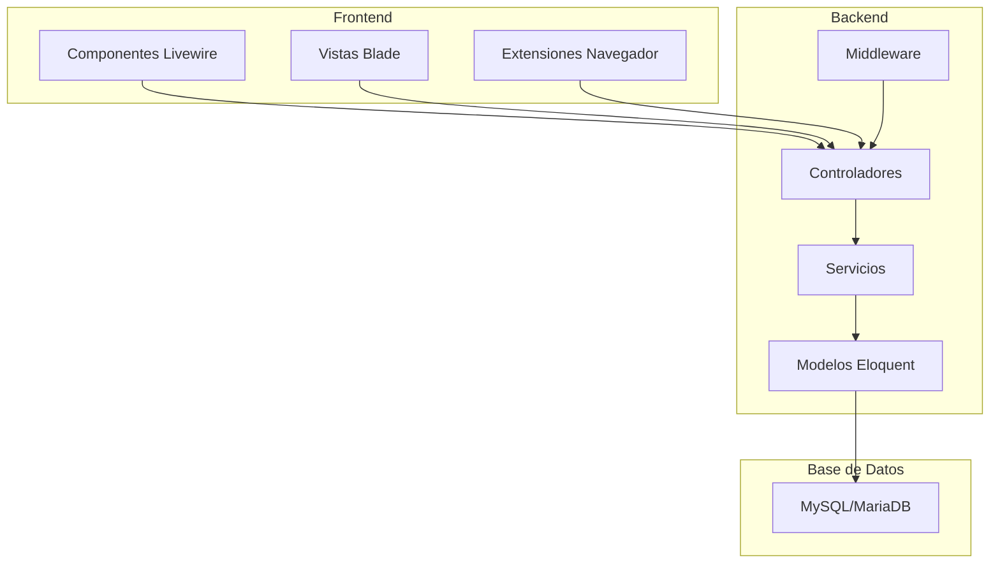
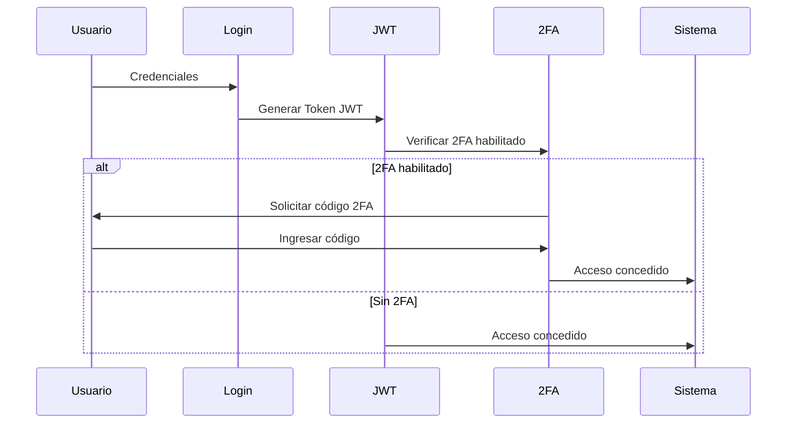

# Análisis de la Estructura del Proyecto

## Resumen General

Este es un sistema web desarrollado con **Laravel 9** orientado a la gestión de tesorería municipal, con funcionalidades específicas para el procesamiento de Comprobantes Fiscales Electrónicos (CFEs) y diversas operaciones financieras.

---

## Tecnologías Principales

| Tecnología | Versión | Propósito |
|------------|---------|-----------|
| Laravel Framework | ^9.0 | Backend PHP |
| Livewire | 2.12.7 | Componentes interactivos |
| Laravel Sanctum | ^2.14 | Autenticación API |
| JWT Auth | 1.4.2 | Autenticación basada en tokens |
| Spatie Permission | 5.11 | Gestión de roles y permisos |
| Smalot PDF Parser | ^2.0 | Procesamiento de PDFs |
| Intervention Image | ^3.11 | Procesamiento de imágenes |
| Bacon QR Code | ^3.0 | Generación de códigos QR |
| Spatie Activity Log | ^4.7 | Registro de actividad |
| Spatie Backup | ^8.2 | Respaldos del sistema |

---

## Arquitectura del Sistema



---

## Estructura de Directorios

### Directorio Raíz

```
oficinas/
|-- app/                    # Código principal de la aplicación
|-- bootstrap/              # Inicialización del framework
|-- config/                 # Archivos de configuración
|-- database/               # Migraciones, seeders y factories
|-- docs/                   # Documentación
|-- extension-cfe-detect/   # Extensión de Chrome para detectar CFEs
|-- extension-text-replacer/# Extensión para reemplazo de texto
|-- lang/                   # Archivos de traducción
|-- plans/                  # Planos y análisis del proyecto
|-- public/                 # Archivos públicos y assets
|-- resources/              # Vistas, assets sin compilar
|-- routes/                 # Definición de rutas
|-- scripts/                # Scripts de utilidad
|-- storage/                # Almacenamiento de archivos
|-- tests/                  # Pruebas automatizadas
```

---

## Módulos Principales

### 1. Sistema de Autenticación y Seguridad

- **JWT Authentication**: Autenticación basada en tokens
- **Two-Factor Authentication**: Verificación en dos pasos con códigos de recuperación
- **Gestión de Roles y Permisos**: Sistema completo con Spatie Permission
- **Middleware de Seguridad**: Verificación de JWT, roles y 2FA

**Controladores involucrados:**
- [`AuthController`](app/Http/Controllers/AuthController.php)
- [`TwoFactorController`](app/Http/Controllers/TwoFactorController.php)
- [`RoleController`](app/Http/Controllers/RoleController.php)
- [`PermissionController`](app/Http/Controllers/PermissionController.php)

### 2. Módulo de Tesorería

El módulo más extenso del sistema, subdividido en:

#### 2.1 Multas de Tránsito
- Gestión de multas de tránsito
- Acceso público para consulta
- Exportación a PDF
- **Componentes Livewire**:
  - [`Multa`](app/Http/Livewire/Tesoreria/Multa.php)
  - [`MultaPublico`](app/Http/Livewire/Tesoreria/MultaPublico.php)

#### 2.2 Multas Cobradas
- Registro de multas cobradas
- Carga de CFEs asociados
- Reportes avanzados
- **Componentes Livewire**:
  - [`MultasCobradas`](app/Http/Livewire/Tesoreria/MultasCobradas/MultasCobradas.php)
  - [`MultasCobradasReporte`](app/Http/Livewire/Tesoreria/MultasCobradas/MultasCobradasReporte.php)

#### 2.3 Caja Chica
- Gestión de fondos de caja chica
- Acreedores y dependencias
- Pagos y pendientes
- **Controladores**:
  - [`CajaChicaController`](app/Http/Controllers/Tesoreria/CajaChica/CajaChicaController.php)
  - [`PendienteController`](app/Http/Controllers/Tesoreria/CajaChica/PendienteController.php)

#### 2.4 Cheques
- Gestión de libretas de cheques
- Emisión de cheques
- Planillas de cheques
- Reportes

#### 2.5 Arrendamientos
- Gestión de contratos de arrendamiento
- Carga de CFEs
- Planillas de pago
- Reportes avanzados

#### 2.6 Armas (Porte y Tenencia)
- Gestión de permisos de porte de armas
- Gestión de tenencia de armas
- Planillas y reportes

#### 2.7 Eventuales
- Pagos eventuales
- Gestión de instituciones
- Planillas de pago

#### 2.8 Certificados de Residencia
- Emisión de certificados
- Carga de CFEs
- Reportes

#### 2.9 Prendas
- Gestión de prendas vehiculares
- Planillas
- Reportes

#### 2.10 Depósito de Vehículos
- Registro de vehículos en depósito
- Planillas
- Reportes

#### 2.11 Valores
- Gestión de valores
- Entrega de libretas
- Tipos de libretas
- Servicios asociados

### 3. Sistema de CFEs

Sistema especializado para procesar Comprobantes Fiscales Electrónicos:

**Modelos:**
- [`TesCfePendiente`](app/Models/TesCfePendiente.php) - CFEs pendientes de confirmación

**Servicios:**
- [`CfeProcessorService`](app/Services/CfeProcessorService.php) - Procesamiento de PDFs

**Controladores:**
- [`CfeController`](app/Http/Controllers/CfeController.php) - API REST para CFEs

**Extensión del Navegador:**
- Detecta descargas de PDFs
- Envía CFEs al backend para procesamiento

### 4. Gestión de Usuarios

- CRUD completo de usuarios
- Gestión de perfiles
- Reset de contraseñas
- Asignación de roles y permisos

**Controlador:** [`UsuarioController`](app/Http/Controllers/UsuarioController.php)

### 5. Sistema de Respaldos

- Creación de respaldos
- Restauración
- Descarga de archivos de respaldo

**Controlador:** [`BackupController`](app/Http/Controllers/BackupController.php)

### 6. Auditoría

- Registro de actividades del sistema
- Historial de cambios

**Componente:** [`Auditoria\Index`](app/Http/Livewire/Sistema/Auditoria/Index.php)

---

## Flujo de Autenticación



---

## Estructura de Rutas

### Rutas Públicas
- `/` - Página de inicio
- `/login` - Formulario de login
- `/multas-transito-publico` - Consulta pública de multas
- `/download-extension` - Descarga de extensión CFE
- `/tema/cambiar` - Cambio de tema visual

### Rutas Protegidas (JWT + 2FA)

| Prefijo | Módulo | Descripción |
|---------|--------|-------------|
| `/panel` | Panel | Dashboard principal |
| `/usuarios` | Usuarios | Gestión de usuarios |
| `/roles` | Roles | Gestión de roles |
| `/permisos` | Permisos | Gestión de permisos |
| `/modulos` | Módulos | Gestión de módulos |
| `/pendrive` | Pendrive Virtual | Almacenamiento de archivos |
| `/tesoreria` | Tesorería | Todos los submódulos financieros |
| `/system/backups` | Respaldos | Gestión de backups |
| `/sistema/auditoria` | Auditoría | Historial de actividades |

### API Routes
- `/api/cfe/procesar` - Procesar CFE
- `/api/cfe/pendientes` - Listar CFEs pendientes
- `/api/cfe/{id}/confirmar` - Confirmar CFE
- `/api/cfe/{id}/rechazar` - Rechazar CFE
- `/api/cfe/analizar` - Analizar CFE

---

## Roles del Sistema

Basado en el análisis del código, los roles identificados son:

| Rol | Descripción |
|-----|-------------|
| `administrador` | Acceso total al sistema |
| `gerente_tesoreria` | Supervisión de tesorería |
| `supervisor_tesoreria` | Control operativo |
| `operador_tesoreria` | Operaciones diarias |

---

## Extensiones del Navegador

### 1. Extensión CFE Detect
- **Ubicación:** `extension-cfe-detect/`
- **Propósito:** Detectar descargas de PDFs de CFEs
- **Funcionamiento:** Monitorea descargas y envía PDFs al backend

### 2. Extensión Text Replacer
- **Ubicación:** `extension-text-replacer/`
- **Propósito:** Reemplazo de texto en páginas web

---

## Patrones de Diseño Utilizados

1. **MVC (Model-View-Controller)**: Estructura base de Laravel
2. **Service Layer**: Servicios para lógica de negocio compleja
3. **Repository Pattern Implícito**: A través de Eloquent Models
4. **Middleware Chain**: Para autenticación y autorización
5. **Component-Based UI**: Livewire para componentes interactivos

---

## Observaciones y Recomendaciones

### Fortalezas
- Sistema de autenticación robusto con JWT y 2FA
- Módulo de tesorería completo y bien organizado
- Uso extensivo de Livewire para interfaces interactivas
- Sistema de auditoría implementado
- Respaldos automatizados

### Áreas de Mejora Potencial
- Documentación técnica más detallada
- Tests automatizados más comprehensivos
- Separación más clara entre lógica de controladores y servicios
- Implementación de cache para optimizar rendimiento

---

## Conclusión

Este es un sistema de gestión de tesorería municipal bien estructurado, con un enfoque moderno utilizando Laravel y Livewire. La arquitectura soporta múltiples módulos financieros con un sistema de seguridad robusto que incluye autenticación JWT, verificación en dos pasos, y control de acceso basado en roles y permisos.
