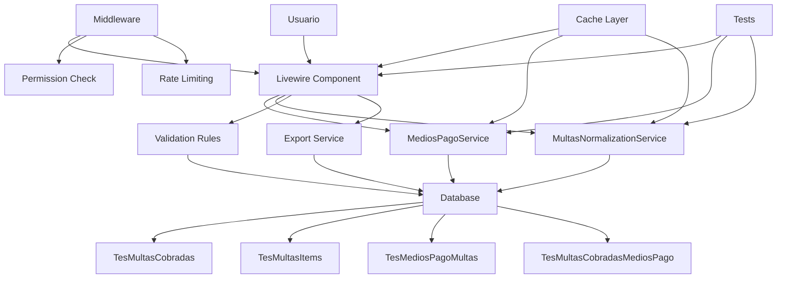

# Análisis y Sugerencias de Mejora - Sección Multas Cobradas

## Resumen Ejecutivo

Este documento presenta un análisis detallado de la sección de multas cobradas del sistema de tesorería, identificando áreas de mejora en arquitectura, funcionalidad, seguridad y experiencia de usuario.

---

## 1. Arquitectura y Diseño de Base de Datos

### 1.1 Problemas Identificados

#### Problema: Relación Inicial Incorrecta

**Ubicación:** [`database/migrations/2026_01_16_111635_create_tes_multas_cobradas_table.php`](database/migrations/2026_01_16_111635_create_tes_multas_cobradas_table.php:27)

**Descripción:** La migración inicial creó una foreign key `multas_items_id` en la tabla `tes_multas_cobradas`, lo que implicaba una relación muchos-a-uno incorrecta. Esto fue corregido posteriormente en la migración [`2026_01_16_113053_fix_multas_tables_relationship.php`](database/migrations/2026_01_16_113053_fix_multas_tables_relationship.php).

**Impacto:** Confusión en el diseño inicial, requiere migración de corrección.

---

### 1.2 Sugerencias de Mejora

#### Sugerencia 1: Agregar Índices para Mejorar Rendimiento

**Prioridad:** Alta

**Descripción:** Agregar índices compuestos para optimizar consultas frecuentes.

```php
// En una nueva migración
Schema::table('tes_multas_cobradas', function (Blueprint $table) {
    $table->index(['fecha', 'recibo'], 'idx_fecha_recibo');
    $table->index(['nombre', 'cedula'], 'idx_nombre_cedula');
    $table->index('forma_pago', 'idx_forma_pago');
});

Schema::table('tes_multas_items', function (Blueprint $table) {
    $table->index(['tes_multas_cobradas_id', 'detalle'], 'idx_cobrada_detalle');
    $table->index('importe', 'idx_importe');
});
```

**Beneficios:**

- Mejora significativa en tiempos de consulta
- Optimización de búsquedas por fecha y recibo
- Mejor rendimiento en reportes por medio de pago

---

#### Sugerencia 2: Normalizar Campo `forma_pago`

**Prioridad:** Media

**Descripción:** Actualmente el campo `forma_pago` es un campo de texto libre que puede contener múltiples medios separados por "/". Se sugiere crear una tabla dedicada.

```php
// Nueva tabla: tes_medios_pago_multas
Schema::create('tes_medios_pago_multas', function (Blueprint $table) {
    $table->id();
    $table->string('nombre', 100)->unique(); // EJ: EFECTIVO, TARJETA, TRANSFERENCIA
    $table->boolean('activo')->default(true);
    $table->timestamps();
});

// Tabla pivote para pagos combinados
Schema::create('tes_multas_cobradas_medios_pago', function (Blueprint $table) {
    $table->id();
    $table->unsignedBigInteger('tes_multas_cobradas_id');
    $table->unsignedBigInteger('tes_medio_pago_multa_id');
    $table->decimal('monto', 15, 2);
    $table->timestamps();

    $table->foreign('tes_multas_cobradas_id')->references('id')->on('tes_multas_cobradas')->onDelete('cascade');
    $table->foreign('tes_medio_pago_multa_id')->references('id')->on('tes_medios_pago_multas');
    $table->unique(['tes_multas_cobradas_id', 'tes_medio_pago_multa_id']);
});
```

**Beneficios:**

- Integridad referencial garantizada
- Consultas más eficientes
- Facilita reportes y estadísticas
- Evita errores de tipeo

---

#### Sugerencia 3: Agregar Campos de Auditoría Adicionales

**Prioridad:** Media

**Descripción:** Complementar los campos de auditoría existentes con más información.

```php
Schema::table('tes_multas_cobradas', function (Blueprint $table) {
    $table->ipAddress('ip_address')->nullable()->after('updated_by');
    $table->string('user_agent', 500)->nullable()->after('ip_address');
    $table->timestamp('locked_at')->nullable()->after('deleted_at');
    $table->unsignedInteger('locked_by')->nullable()->after('locked_at');
});
```

**Beneficios:**

- Trazabilidad completa de cambios
- Posibilidad de bloquear registros
- Auditoría forense más completa

---

## 2. Lógica de Negocio y Servicios

### 2.1 Problemas Identificados

#### Problema: Código Duplicado en Procesamiento de Medios de Pago

**Ubicación:**

- [`MultasCobradas.php`](app/Http/Livewire/Tesoreria/MultasCobradas/MultasCobradas.php:109-187)
- [`PrintMultasCobradasFull.php`](app/Http/Livewire/Tesoreria/MultasCobradas/PrintMultasCobradasFull.php:32-109)
- [`PrintMultasCobradasResumen.php`](app/Http/Livewire/Tesoreria/MultasCobradas/PrintMultasCobradasResumen.php:38-115)

**Descripción:** La lógica para procesar medios de pago combinados está duplicada en tres componentes diferentes, lo que viola el principio DRY (Don't Repeat Yourself).

**Impacto:**

- Mantenimiento difícil
- Riesgo de inconsistencias
- Código difícil de probar

---

#### Problema: Lógica Compleja de Normalización

**Ubicación:** [`MultasNormalizationService.php`](app/Services/Tesoreria/MultasNormalizationService.php:70-157)

**Descripción:** El servicio de normalización tiene lógica compleja para agrupar y fusionar items basándose en frecuencia de precios. Esta lógica es difícil de entender y mantener.

**Impacto:**

- Difícil de depurar
- Riesgo de errores en agrupación
- Poca flexibilidad para cambios

---

### 2.2 Sugerencias de Mejora

#### Sugerencia 4: Extraer Lógica de Medios de Pago a un Servicio

**Prioridad:** Alta

**Descripción:** Crear un servicio dedicado para procesar medios de pago.

```php
// app/Services/Tesoreria/MediosPagoService.php
namespace App\Services\Tesoreria;

use Illuminate\Support\Collection;

class MediosPagoService
{
    /**
     * Procesa medios de pago y genera totales
     */
    public function procesarMediosPago(Collection $registros): Collection
    {
        $subtotales = [];
        $combinaciones = [];
        $subtotales_combinados = [];

        foreach ($registros as $item) {
            $forma_pago = $item->forma_pago ?: 'SIN DATOS';
            $partes = explode('/', $forma_pago);

            if (count($partes) == 1) {
                $this->procesarPagoSimple($item, $subtotales);
            } else {
                $this->procesarPagoCombinado($item, $partes, $subtotales, $combinaciones, $subtotales_combinados);
            }
        }

        return $this->construirResultado($subtotales, $combinaciones, $subtotales_combinados);
    }

    private function procesarPagoSimple($item, &$subtotales)
    {
        $medio = mb_strtoupper(trim(explode(':', $item->forma_pago)[0]), 'UTF-8');
        $subtotales[$medio] = ($subtotales[$medio] ?? 0) + $item->monto;
    }

    private function procesarPagoCombinado($item, $partes, &$subtotales, &$combinaciones, &$subtotales_combinados)
    {
        // ... lógica de procesamiento combinado
    }

    private function construirResultado($subtotales, $combinaciones, $subtotales_combinados): Collection
    {
        // ... construcción del resultado
    }
}
```

**Uso en componentes:**

```php
// En MultasCobradas.php
use App\Services\Tesoreria\MediosPagoService;

public function render()
{
    $registros_pago = TesMultasCobradas::query()
        ->whereDate('fecha', '>=', $this->resumenFechaDesde)
        ->whereDate('fecha', '<=', $this->resumenFechaHasta)
        ->select('forma_pago', 'monto')
        ->get();

    $mediosPagoService = app(MediosPagoService::class);
    $totalesPorMedio = $mediosPagoService->procesarMediosPago($registros_pago);

    return view('livewire.tesoreria.multas-cobradas.multas-cobradas', [
        'registros' => $registros,
        'totalesPorMedio' => $totalesPorMedio
    ]);
}
```

**Beneficios:**

- Código reutilizable
- Fácil de probar unitariamente
- Mantenimiento centralizado
- Reducción de duplicación

---

#### Sugerencia 5: Simplificar Lógica de Normalización

**Prioridad:** Media

**Descripción:** Refactorizar el servicio de normalización para hacerlo más mantenible.

```php
// app/Services/Tesoreria/MultasNormalizationService.php
class MultasNormalizationService
{
    private const UMBRAL_DOMINANCIA = 3;
    private const DELTA_PRECISION = 0.1;

    public function getResumenData($dateFrom, $dateTo): array
    {
        $items = $this->obtenerItems($dateFrom, $dateTo);
        $grupos = $this->agruparItems($items);
        $grupos = $this->fusionarGruposSimilares($grupos);

        return $this->formatearResultado($grupos);
    }

    private function obtenerItems($dateFrom, $dateTo): Collection
    {
        return TesMultasItems::whereHas('cobrada', function ($q) use ($dateFrom, $dateTo) {
            $q->whereBetween('fecha', [$dateFrom, $dateTo]);
        })->with('cobrada')->get();
    }

    private function agruparItems(Collection $items): array
    {
        $grupos = [];

        foreach ($items as $item) {
            $normalized = $this->normalizeItem($item);
            $key = $this->generarClaveGrupo($normalized, $item);

            if (!isset($grupos[$key])) {
                $grupos[$key] = $this->inicializarGrupo($normalized);
            }

            $this->agregarItemAGrupo($grupos[$key], $item, $normalized);
        }

        return $grupos;
    }

    private function fusionarGruposSimilares(array $grupos): array
    {
        // Lógica simplificada de fusión
        $gruposPorPrecio = $this->agruparPorPrecio($grupos);

        foreach ($gruposPorPrecio as $precio => $claves) {
            if (count($claves) < 2) continue;

            $dominante = $this->encontrarGrupoDominante($grupos, $claves);
            if (!$dominante) continue;

            foreach ($claves as $clave) {
                if ($clave !== $dominante && $this->debeFusionar($grupos[$clave], $grupos[$dominante])) {
                    $grupos[$dominante] = $this->fusionarGrupos($grupos[$dominante], $grupos[$clave]);
                    unset($grupos[$clave]);
                }
            }
        }

        return $grupos;
    }

    private function debeFusionar(array $grupo, array $dominante): bool
    {
        $esNoClasificado = ($grupo['articulo'] === 'Otros / Sin Clasificar');
        $esPequeño = ($grupo['cantidad'] <= 2);
        $dominanteEsFuerte = ($dominante['cantidad'] >= self::UMBRAL_DOMINANCIA);

        return $esNoClasificado || ($esPequeño && $dominanteEsFuerte);
    }

    // ... más métodos auxiliares
}
```

**Beneficios:**

- Código más legible
- Métodos más pequeños y enfocados
- Constantes configurables
- Fácil de extender

---

#### Sugerencia 6: Agregar Validaciones de Negocio

**Prioridad:** Alta

**Descripción:** Implementar validaciones de negocio más robustas.

```php
// app/Rules/ValidarConsistenciaMulta.php
namespace App\Rules;

use Illuminate\Contracts\Validation\Rule;

class ValidarConsistenciaMulta implements Rule
{
    private $items;
    private $montoTotal;

    public function __construct($items, $montoTotal)
    {
        $this->items = $items;
        $this->montoTotal = $montoTotal;
    }

    public function passes($attribute, $value)
    {
        $sumaItems = collect($this->items)->sum('importe');
        return abs($this->montoTotal - $sumaItems) <= 0.1;
    }

    public function message()
    {
        $sumaItems = collect($this->items)->sum('importe');
        $diff = abs($this->montoTotal - $sumaItems);
        return "El monto total ($ {$this->montoTotal}) no coincide con la suma de ítems ($ {$sumaItems}). Diferencia: $ {$diff}";
    }
}

// Uso en MultasCobradas.php
public function save()
{
    $this->validate([
        'recibo' => 'required|string|max:255',
        'fecha' => 'required|date',
        'monto' => 'required|numeric|min:0',
        'items_form' => ['required', 'array', 'min:1', new ValidarConsistenciaMulta($this->items_form, $this->monto)],
        // ... otras validaciones
    ]);

    // ... resto del código
}
```

**Beneficios:**

- Validaciones reutilizables
- Mensajes de error claros
- Prevención de datos inconsistentes

---

## 3. Seguridad y Validación

### 3.1 Problemas Identificados

#### Problema: Falta de Validación de Permisos

**Ubicación:** [`MultasCobradas.php`](app/Http/Livewire/Tesoreria/MultasCobradas/MultasCobradas.php:443-454)

**Descripción:** Los métodos de eliminación y edición no verifican permisos específicos del usuario.

**Impacto:** Riesgo de acceso no autorizado a operaciones críticas.

---

#### Problema: Validación Insuficiente en Carga de CFE

**Ubicación:** [`CargarCfe.php`](app/Http/Livewire/Tesoreria/MultasCobradas/CargarCfe.php:276-354)

**Descripción:** La validación de consistencia de totales se hace manualmente en lugar de usar reglas de validación de Laravel.

**Impacto:** Posible inconsistencia de datos.

---

### 3.2 Sugerencias de Mejora

#### Sugerencia 7: Implementar Middleware de Permisos

**Prioridad:** Alta

**Descripción:** Agregar verificación de permisos en operaciones críticas.

```php
// app/Http/Middleware/VerificarPermisoMultas.php
namespace App\Http\Middleware;

use Closure;
use Illuminate\Support\Facades\Auth;

class VerificarPermisoMultas
{
    public function handle($request, Closure $next, $permiso)
    {
        if (!Auth::user()->can($permiso)) {
            abort(403, 'No tienes permiso para realizar esta acción.');
        }

        return $next($request);
    }
}

// En MultasCobradas.php
public function delete()
{
    // Verificar permiso antes de eliminar
    if (!auth()->user()->can('eliminar multas cobradas')) {
        session()->flash('error', 'No tienes permiso para eliminar multas.');
        return;
    }

    $registro = TesMultasCobradas::find($this->deleteId);
    if ($registro) {
        $registro->deleted_by = auth()->id();
        $registro->save();
        $registro->delete();
        session()->flash('message', 'Registro eliminado correctamente.');
    }
    $this->showDeleteModal = false;
    Cache::flush();
}
```

**Beneficios:**

- Control de acceso granular
- Auditoría de permisos
- Cumplimiento de seguridad

---

#### Sugerencia 8: Mejorar Validación de Archivos PDF

**Prioridad:** Media

**Descripción:** Implementar validaciones más robustas para archivos PDF.

```php
// app/Rules/ValidarPdfCfe.php
namespace App\Rules;

use Illuminate\Contracts\Validation\Rule;

class ValidarPdfCfe implements Rule
{
    public function passes($attribute, $value)
    {
        // Verificar que sea un PDF válido
        if ($value->getMimeType() !== 'application/pdf') {
            return false;
        }

        // Verificar tamaño máximo (10MB)
        if ($value->getSize() > 10 * 1024 * 1024) {
            return false;
        }

        // Verificar que el PDF no esté corrupto
        try {
            $parser = new \Smalot\PdfParser\Parser();
            $pdf = $parser->parseFile($value->getRealPath());
            $text = $pdf->getText();

            // Verificar contenido mínimo
            if (strlen($text) < 100) {
                return false;
            }

            // Verificar que contenga palabras clave de CFE
            $palabrasClave = ['CFE', 'RECIBO', 'TOTAL', 'FECHA'];
            $textoUpper = strtoupper($text);
            $coincidencias = 0;

            foreach ($palabrasClave as $palabra) {
                if (strpos($textoUpper, $palabra) !== false) {
                    $coincidencias++;
                }
            }

            return $coincidencias >= 2;
        } catch (\Exception $e) {
            return false;
        }
    }

    public function message()
    {
        return 'El archivo debe ser un PDF válido de CFE con contenido legible.';
    }
}

// Uso en CargarCfe.php
protected $rules = [
    'archivo' => ['required', 'mimes:pdf', 'max:10240', new ValidarPdfCfe()],
];
```

**Beneficios:**

- Prevención de archivos maliciosos
- Mejor experiencia de usuario
- Reducción de errores de procesamiento

---

#### Sugerencia 9: Implementar Rate Limiting

**Prioridad:** Media

**Descripción:** Limitar la frecuencia de operaciones críticas.

```php
// En routes/web.php
Route::middleware(['auth', 'throttle:60,1'])->group(function () {
    Route::get('/tesoreria/multas-cobradas', [MultasCobradas::class, 'render'])
        ->name('tesoreria.multas-cobradas.index')
        ->middleware('can:ver multas cobradas');

    Route::post('/tesoreria/multas-cobradas/guardar', [MultasCobradas::class, 'save'])
        ->middleware('can:crear multas cobradas')
        ->name('tesoreria.multas-cobradas.guardar');
});
```

**Beneficios:**

- Protección contra ataques de fuerza bruta
- Prevención de abuso del sistema
- Mejor rendimiento general

---

## 4. Experiencia de Usuario (UX)

### 4.1 Problemas Identificados

#### Problema: Feedback Insuficiente en Operaciones

**Ubicación:** [`MultasCobradas.php`](app/Http/Livewire/Tesoreria/MultasCobradas/MultasCobradas.php:372-435)

**Descripción:** Las operaciones de guardado no proporcionan feedback visual durante el proceso.

**Impacto:** Usuario no sabe si la operación está en progreso.

---

#### Problema: Formulario de Edición Complejo

**Ubicación:** [`multas-cobradas.blade.php`](resources/views/livewire/tesoreria/multas-cobradas/multas-cobradas.blade.php:246-406)

**Descripción:** El modal de edición tiene muchos campos y puede ser abrumador.

**Impacto:** Posibles errores de entrada de datos.

---

### 4.2 Sugerencias de Mejora

#### Sugerencia 10: Agregar Indicadores de Carga

**Prioridad:** Alta

**Descripción:** Implementar indicadores visuales de carga.

```php
// En MultasCobradas.php
public function save()
{
    $this->validate();

    try {
        DB::beginTransaction();

        // Emitir evento de inicio de carga
        $this->emit('loadingStarted');

        $data = $this->convertirCamposAMayusculas(
            ['nombre', 'domicilio', 'adicional', 'referencias', 'adenda'],
            [
                'recibo' => $this->recibo,
                'cedula' => $this->cedula,
                'nombre' => $this->nombre,
                'domicilio' => $this->domicilio,
                'adicional' => $this->adicional,
                'fecha' => $this->fecha,
                'monto' => $this->monto,
                'referencias' => $this->referencias,
                'adenda' => $this->adenda,
                'forma_pago' => $this->forma_pago ?: 'SIN DATOS',
            ]
        );

        if ($this->editMode) {
            $cobro = TesMultasCobradas::find($this->registro_id);
            $data['updated_by'] = auth()->id();
            $cobro->update($data);

            $cobro->items()->delete();
            foreach ($this->items_form as $itemData) {
                $cobro->items()->create([
                    'detalle' => mb_strtoupper($itemData['detalle'], 'UTF-8'),
                    'descripcion' => mb_strtoupper($itemData['descripcion'], 'UTF-8'),
                    'importe' => $itemData['importe'],
                    'created_by' => auth()->id(),
                ]);
            }

            session()->flash('message', 'Multa cobrada actualizada exitosamente.');
        } else {
            $data['created_by'] = auth()->id();
            $cobro = TesMultasCobradas::create($data);

            foreach ($this->items_form as $itemData) {
                $cobro->items()->create([
                    'detalle' => mb_strtoupper($itemData['detalle'], 'UTF-8'),
                    'descripcion' => mb_strtoupper($itemData['descripcion'], 'UTF-8'),
                    'importe' => $itemData['importe'],
                    'created_by' => auth()->id(),
                ]);
            }
            session()->flash('message', 'Multa cobrada registrada exitosamente.');
        }

        DB::commit();

        // Emitir evento de finalización
        $this->emit('loadingCompleted');

        $this->showModal = false;
        $this->resetForm();
        Cache::flush();
    } catch (\Exception $e) {
        DB::rollBack();
        $this->emit('loadingError', $e->getMessage());
        session()->flash('error', 'Error al guardar: ' . $e->getMessage());
    }
}
```

**En la vista:**

```blade
<!-- En multas-cobradas.blade.php -->
<div wire:loading wire:target="save" class="text-center py-3">
    <div class="spinner-border text-primary" role="status">
        <span class="sr-only">Guardando...</span>
    </div>
    <p class="mt-2 text-muted">Guardando registro...</p>
</div>

<script>
    window.addEventListener('loadingStarted', () => {
        // Mostrar overlay de carga
    });

    window.addEventListener('loadingCompleted', () => {
        // Ocultar overlay y mostrar éxito
        Swal.fire({
            icon: 'success',
            title: '¡Éxito!',
            text: 'El registro se guardó correctamente.',
            timer: 2000,
            showConfirmButton: false
        });
    });

    window.addEventListener('loadingError', (event) => {
        // Mostrar error
        Swal.fire({
            icon: 'error',
            title: 'Error',
            text: event.detail
        });
    });
</script>
```

**Beneficios:**

- Mejor feedback al usuario
- Reducción de incertidumbre
- Experiencia más profesional

---

#### Sugerencia 11: Implementar Autocompletado para Campos

**Prioridad:** Media

**Descripción:** Agregar autocompletado para campos como nombre, cédula y domicilio.

```php
// En MultasCobradas.php
public $sugerenciasNombre = [];
public $sugerenciasCedula = [];

public function updatedNombre($value)
{
    if (strlen($value) >= 3) {
        $this->sugerenciasNombre = TesMultasCobradas::where('nombre', 'like', '%' . $value . '%')
            ->distinct()
            ->pluck('nombre')
            ->take(5)
            ->toArray();
    } else {
        $this->sugerenciasNombre = [];
    }
}

public function seleccionarNombre($nombre)
{
    $this->nombre = $nombre;
    $this->sugerenciasNombre = [];

    // Auto-completar otros campos si existe el registro
    $registro = TesMultasCobradas::where('nombre', $nombre)->first();
    if ($registro) {
        $this->cedula = $registro->cedula;
        $this->domicilio = $registro->domicilio;
    }
}
```

**En la vista:**

```blade
<div class="col-md-5">
    <div class="form-group mb-1 position-relative">
        <label class="small font-weight-bold mb-0">NOMBRE / RAZÓN SOCIAL</label>
        <input type="text"
               class="form-control form-control-sm"
               wire:model="nombre"
               wire:keydown.enter.prevent="seleccionarNombre(nombre)"
               placeholder="Nombre completo..."
               autocomplete="off">
        @if($sugerenciasNombre)
        <div class="dropdown-menu show position-absolute w-100" style="z-index: 1000;">
            @foreach($sugerenciasNombre as $sugerencia)
            <a href="#" wire:click.prevent="seleccionarNombre('{{ $sugerencia }}')"
               class="dropdown-item">
                {{ $sugerencia }}
            </a>
            @endforeach
        </div>
        @endif
    </div>
</div>
```

**Beneficios:**

- Reducción de errores de tipeo
- Ahorro de tiempo
- Mejor consistencia de datos

---

#### Sugerencia 12: Agregar Confirmación de Eliminación con Detalles

**Prioridad:** Alta

**Descripción:** Mostrar detalles del registro antes de confirmar eliminación.

```php
// En MultasCobradas.php
public $registroAEliminar = null;

public function confirmDelete($id)
{
    $this->deleteId = $id;
    $this->registroAEliminar = TesMultasCobradas::with('items')->find($id);
    $this->showDeleteModal = true;
}
```

**En la vista:**

```blade
<!-- Modal de confirmación de eliminación -->
@if($showDeleteModal)
<div class="modal fade show" style="display: block;" tabindex="-1" role="dialog">
    <div class="modal-dialog" role="document">
        <div class="modal-content">
            <div class="modal-header bg-danger text-white">
                <h5 class="modal-title">
                    <i class="fas fa-exclamation-triangle mr-2"></i>
                    Confirmar Eliminación
                </h5>
                <button type="button" class="close text-white" wire:click="$set('showDeleteModal', false)">
                    <span>&times;</span>
                </button>
            </div>
            <div class="modal-body">
                @if($registroAEliminar)
                <div class="alert alert-warning">
                    <strong>¿Estás seguro de eliminar este registro?</strong>
                    <p class="mb-0">Esta acción no se puede deshacer.</p>
                </div>

                <div class="card bg-light">
                    <div class="card-body">
                        <h6 class="font-weight-bold mb-3">Detalles del Registro:</h6>
                        <div class="row">
                            <div class="col-md-6">
                                <p class="mb-1"><strong>Recibo:</strong> {{ $registroAEliminar->recibo }}</p>
                                <p class="mb-1"><strong>Fecha:</strong> {{ $registroAEliminar->fecha->format('d/m/Y') }}</p>
                                <p class="mb-1"><strong>Nombre:</strong> {{ $registroAEliminar->nombre }}</p>
                            </div>
                            <div class="col-md-6">
                                <p class="mb-1"><strong>Cédula:</strong> {{ $registroAEliminar->cedula }}</p>
                                <p class="mb-1"><strong>Monto:</strong> {{ $registroAEliminar->monto_formateado }}</p>
                                <p class="mb-1"><strong>Ítems:</strong> {{ $registroAEliminar->items->count() }}</p>
                            </div>
                        </div>

                        @if($registroAEliminar->items->count() > 0)
                        <hr class="my-3">
                        <h6 class="font-weight-bold mb-2">Ítems a eliminar:</h6>
                        <ul class="list-unstyled mb-0">
                            @foreach($registroAEliminar->items as $item)
                            <li class="mb-1">
                                <i class="fas fa-times text-danger mr-1"></i>
                                {{ $item->detalle }} - ${{ number_format($item->importe, 2, ',', '.') }}
                            </li>
                            @endforeach
                        </ul>
                        @endif
                    </div>
                </div>
                @endif
            </div>
            <div class="modal-footer">
                <button type="button" class="btn btn-secondary" wire:click="$set('showDeleteModal', false)">
                    <i class="fas fa-times mr-1"></i> Cancelar
                </button>
                <button type="button" class="btn btn-danger" wire:click="delete">
                    <i class="fas fa-trash mr-1"></i> Eliminar Definitivamente
                </button>
            </div>
        </div>
    </div>
</div>
<div class="modal-backdrop fade show"></div>
@endif
```

**Beneficios:**

- Prevención de eliminaciones accidentales
- Mayor confianza del usuario
- Mejor experiencia de usuario

---

## 5. Rendimiento y Optimización

### 5.1 Problemas Identificados

#### Problema: Consultas N+1 en Listado Principal

**Ubicación:** [`MultasCobradas.php`](app/Http/Livewire/Tesoreria/MultasCobradas/MultasCobradas.php:95-105)

**Descripción:** Aunque se usa `with('items')`, la consulta podría optimizarse más.

**Impacto:** Rendimiento subóptimo con muchos registros.

---

#### Problema: Cache Flush Innecesario

**Ubicación:** Múltiples archivos

**Descripción:** Se usa `Cache::flush()` que elimina toda la caché del sistema.

**Impacto:** Pérdida de caché de otros módulos.

---

### 5.2 Sugerencias de Mejora

#### Sugerencia 13: Optimizar Consultas con Eager Loading Selectivo

**Prioridad:** Alta

**Descripción:** Seleccionar solo los campos necesarios en las relaciones.

```php
// En MultasCobradas.php
public function render()
{
    $registros = TesMultasCobradas::with(['items:id,tes_multas_cobradas_id,detalle,importe'])
        ->whereYear('fecha', $this->anio)
        ->whereMonth('fecha', $this->mes)
        ->where(function ($query) {
            $query->where('nombre', 'like', '%' . $this->search . '%')
                ->orWhere('recibo', 'like', '%' . $this->search . '%')
                ->orWhere('cedula', 'like', '%' . $this->search . '%');
        })
        ->orderBy('fecha', 'desc')
        ->orderByRaw('LENGTH(recibo) DESC, recibo DESC')
        ->paginate(25);

    // ... resto del código
}
```

**Beneficios:**

- Reducción de memoria
- Mejor rendimiento de consultas
- Menos transferencia de datos

---

#### Sugerencia 14: Implementar Caching Selectivo

**Prioridad:** Media

**Descripción:** Usar tags de caché para invalidación selectiva.

```php
// En MultasCobradas.php
public function save()
{
    // ... código de guardado

    // Invalidar solo caché relevante
    Cache::tags(['multas_cobradas', 'tesoreria'])->flush();

    // O invalidar por clave específica
    Cache::forget("multas_cobradas_{$this->anio}_{$this->mes}");
}

public function render()
{
    $cacheKey = "multas_cobradas_{$this->anio}_{$this->mes}_{$this->search}";

    $registros = Cache::remember($cacheKey, 300, function () {
        return TesMultasCobradas::with(['items:id,tes_multas_cobradas_id,detalle,importe'])
            ->whereYear('fecha', $this->anio)
            ->whereMonth('fecha', $this->mes)
            ->where(function ($query) {
                $query->where('nombre', 'like', '%' . $this->search . '%')
                    ->orWhere('recibo', 'like', '%' . $this->search . '%')
                    ->orWhere('cedula', 'like', '%' . $this->search . '%');
            })
            ->orderBy('fecha', 'desc')
            ->orderByRaw('LENGTH(recibo) DESC, recibo DESC')
            ->paginate(25);
    });

    // ... resto del código
}
```

**Beneficios:**

- Mejor rendimiento
- Menos carga en base de datos
- Caché más eficiente

---

#### Sugerencia 15: Implementar Lazy Loading para Imágenes/PDFs

**Prioridad:** Baja

**Descripción:** Si se agregan archivos adjuntos, usar lazy loading.

```blade
<!-- Ejemplo para vista de detalle -->
@if($selectedRegistro->archivo_adjunto)
<div class="text-center mt-3">
    <button wire:click="$set('mostrarPdf', true)" class="btn btn-outline-primary">
        <i class="fas fa-file-pdf mr-1"></i> Ver CFE Adjunto
    </button>
</div>

@if($mostrarPdf)
<div class="modal fade show" style="display: block;" tabindex="-1">
    <div class="modal-dialog modal-xl">
        <div class="modal-content">
            <div class="modal-header">
                <h5 class="modal-title">CFE Adjunto</h5>
                <button type="button" class="close" wire:click="$set('mostrarPdf', false)">
                    <span>&times;</span>
                </button>
            </div>
            <div class="modal-body">
                <iframe src="{{ $selectedRegistro->archivo_adjunto }}"
                        width="100%"
                        height="600px"
                        loading="lazy">
                </iframe>
            </div>
        </div>
    </div>
</div>
@endif
@endif
```

**Beneficios:**

- Carga más rápida de página
- Mejor experiencia de usuario
- Menor consumo de ancho de banda

---

## 6. Testing y Calidad de Código

### 6.1 Problemas Identificados

#### Problema: Ausencia de Tests Unitarios

**Descripción:** No se encontraron archivos de prueba para el módulo de multas cobradas.

**Impacto:** Riesgo de regresiones en cambios futuros.

---

#### Problema: Falta de Documentación de Código

**Descripción:** Muchos métodos no tienen comentarios PHPDoc.

**Impacto:** Dificultad de mantenimiento y onboarding.

---

### 6.2 Sugerencias de Mejora

#### Sugerencia 16: Crear Suite de Tests

**Prioridad:** Alta

**Descripción:** Implementar tests unitarios y de integración.

```php
// tests/Unit/Models/TesMultasCobradasTest.php
namespace Tests\Unit\Models;

use App\Models\Tesoreria\TesMultasCobradas;
use App\Models\Tesoreria\TesMultasItems;
use App\Models\User;
use Illuminate\Foundation\Testing\RefreshDatabase;
use Tests\TestCase;

class TesMultasCobradasTest extends TestCase
{
    use RefreshDatabase;

    public function test_puede_crear_multa_cobrada()
    {
        $user = User::factory()->create();

        $multa = TesMultasCobradas::create([
            'recibo' => 'A-12345',
            'fecha' => now(),
            'monto' => 1000.00,
            'nombre' => 'Juan Pérez',
            'cedula' => '12345678',
            'created_by' => $user->id,
        ]);

        $this->assertDatabaseHas('tes_multas_cobradas', [
            'recibo' => 'A-12345',
            'monto' => 1000.00,
        ]);
    }

    public function test_relacion_con_items()
    {
        $multa = TesMultasCobradas::factory()->create();
        $item = TesMultasItems::factory()->create([
            'tes_multas_cobradas_id' => $multa->id,
        ]);

        $this->assertCount(1, $multa->items);
        $this->assertEquals($multa->id, $item->cobrada->id);
    }

    public function test_accesor_monto_formateado()
    {
        $multa = TesMultasCobradas::factory()->create(['monto' => 1234.56]);

        $this->assertEquals('$ 1.234,56', $multa->monto_formateado);
    }

    public function test_soft_delete()
    {
        $multa = TesMultasCobradas::factory()->create();
        $multa->delete();

        $this->assertSoftDeleted('tes_multas_cobradas', ['id' => $multa->id]);
    }
}

// tests/Unit/Services/MediosPagoServiceTest.php
namespace Tests\Unit\Services;

use App\Services\Tesoreria\MediosPagoService;
use App\Models\Tesoreria\TesMultasCobradas;
use Illuminate\Foundation\Testing\RefreshDatabase;
use Tests\TestCase;

class MediosPagoServiceTest extends TestCase
{
    use RefreshDatabase;

    public function test_procesa_pago_simple()
    {
        $service = new MediosPagoService();

        $registros = collect([
            (object)['forma_pago' => 'EFECTIVO', 'monto' => 1000],
            (object)['forma_pago' => 'EFECTIVO', 'monto' => 500],
        ]);

        $resultado = $service->procesarMediosPago($registros);

        $efectivo = $resultado->firstWhere('forma_pago', 'EFECTIVO');
        $this->assertEquals(1500, $efectivo->total);
    }

    public function test_procesa_pago_combinado()
    {
        $service = new MediosPagoService();

        $registros = collect([
            (object)['forma_pago' => 'EFECTIVO: 500 / TARJETA: 500', 'monto' => 1000],
        ]);

        $resultado = $service->procesarMediosPago($registros);

        $efectivo = $resultado->firstWhere('forma_pago', 'EFECTIVO');
        $tarjeta = $resultado->firstWhere('forma_pago', 'TARJETA');

        $this->assertEquals(500, $efectivo->total);
        $this->assertEquals(500, $tarjeta->total);
    }
}

// tests/Feature/Livewire/MultasCobradasTest.php
namespace Tests\Feature\Livewire;

use App\Http\Livewire\Tesoreria\MultasCobradas\MultasCobradas;
use App\Models\Tesoreria\TesMultasCobradas;
use App\Models\User;
use Illuminate\Foundation\Testing\RefreshDatabase;
use Livewire\Livewire;
use Tests\TestCase;

class MultasCobradasTest extends TestCase
{
    use RefreshDatabase;

    public function test_puede_renderizar_componente()
    {
        $user = User::factory()->create();

        Livewire::actingAs($user)
            ->test(MultasCobradas::class)
            ->assertStatus(200);
    }

    public function test_puede_crear_multa()
    {
        $user = User::factory()->create();

        Livewire::actingAs($user)
            ->test(MultasCobradas::class)
            ->set('recibo', 'A-12345')
            ->set('fecha', now()->format('Y-m-d'))
            ->set('monto', 1000)
            ->set('nombre', 'Juan Pérez')
            ->set('items_form', [['detalle' => 'Multa Art. 141', 'importe' => 1000]])
            ->call('save')
            ->assertHasNoErrors();

        $this->assertDatabaseHas('tes_multas_cobradas', [
            'recibo' => 'A-12345',
            'monto' => 1000,
        ]);
    }

    public function test_valida_consistencia_de_totales()
    {
        $user = User::factory()->create();

        Livewire::actingAs($user)
            ->test(MultasCobradas::class)
            ->set('recibo', 'A-12345')
            ->set('fecha', now()->format('Y-m-d'))
            ->set('monto', 1000)
            ->set('items_form', [
                ['detalle' => 'Multa Art. 141', 'importe' => 500],
                ['detalle' => 'Multa Art. 170', 'importe' => 300],
            ])
            ->call('save')
            ->assertHasErrors(['items_form']);
    }
}
```

**Beneficios:**

- Detección temprana de errores
- Documentación viva del código
- Facilita refactoring seguro
- Mayor confianza en cambios

---

#### Sugerencia 17: Agregar PHPDoc Completo

**Prioridad:** Media

**Descripción:** Documentar todos los métodos públicos y clases.

```php
/**
 * Componente Livewire para gestión de Multas Cobradas
 *
 * Este componente maneja el CRUD completo de multas cobradas,
 * incluyendo carga de CFEs, generación de reportes y
 * cálculo de totales por medio de pago.
 *
 * @package App\Http\Livewire\Tesoreria\MultasCobradas
 */
class MultasCobradas extends Component
{
    /**
     * Lista de registros de multas cobradas paginados
     *
     * @var \Illuminate\Pagination\LengthAwarePaginator
     */
    public $registros;

    /**
     * Año actual para filtrado
     *
     * @var int
     */
    public $anio;

    /**
     * Mes actual para filtrado (1-12)
     *
     * @var int
     */
    public $mes;

    /**
     * Texto de búsqueda para filtrar por nombre, recibo o cédula
     *
     * @var string
     */
    public $search = '';

    /**
     * Renderiza el componente con los datos necesarios
     *
     * Obtiene los registros de multas cobradas filtrados por año/mes
     * y calcula los totales por medio de pago para el rango
     * de fechas seleccionado en el resumen.
     *
     * @return \Illuminate\View\View
     */
    public function render()
    {
        // ... código
    }

    /**
     * Guarda una nueva multa cobrada o actualiza una existente
     *
     * Valida los datos, crea/actualiza el registro principal y
     * sus items asociados. Maneja transacciones de base de datos
     * para garantizar integridad.
     *
     * @return void
     * @throws \Exception Si ocurre un error durante el guardado
     */
    public function save()
    {
        // ... código
    }

    /**
     * Elimina un registro de multa cobrada
     *
     * Realiza un soft delete del registro, registrando el usuario
     * que realizó la eliminación para auditoría.
     *
     * @return void
     */
    public function delete()
    {
        // ... código
    }
}
```

**Beneficios:**

- Mejor comprensión del código
- Facilita IDE autocomplete
- Documentación generada automáticamente
- Mejor onboarding de nuevos desarrolladores

---

## 7. Funcionalidades Adicionales Sugeridas

### Sugerencia 18: Exportación a Excel

**Prioridad:** Media

**Descripción:** Agregar capacidad de exportar datos a Excel.

```php
// app/Exports/MultasCobradasExport.php
namespace App\Exports;

use App\Models\Tesoreria\TesMultasCobradas;
use Maatwebsite\Excel\Concerns\FromCollection;
use Maatwebsite\Excel\Concerns\WithHeadings;
use Maatwebsite\Excel\Concerns\WithMapping;
use Maatwebsite\Excel\Concerns\WithTitle;

class MultasCobradasExport implements FromCollection, WithHeadings, WithMapping, WithTitle
{
    protected $fechaDesde;
    protected $fechaHasta;

    public function __construct($fechaDesde, $fechaHasta)
    {
        $this->fechaDesde = $fechaDesde;
        $this->fechaHasta = $fechaHasta;
    }

    public function collection()
    {
        return TesMultasCobradas::with('items')
            ->whereDate('fecha', '>=', $this->fechaDesde)
            ->whereDate('fecha', '<=', $this->fechaHasta)
            ->orderBy('fecha', 'asc')
            ->get();
    }

    public function headings(): array
    {
        return [
            'Fecha',
            'Recibo',
            'Nombre',
            'Cédula',
            'Domicilio',
            'Monto Total',
            'Medio de Pago',
            'Ítems',
            'Referencias',
            'Adenda',
            'Creado Por',
            'Fecha Creación',
        ];
    }

    public function map($multa): array
    {
        $items = $multa->items->map(function ($item) {
            return "{$item->detalle} - {$item->importe}";
        })->implode(', ');

        return [
            $multa->fecha->format('d/m/Y'),
            $multa->recibo,
            $multa->nombre,
            $multa->cedula,
            $multa->domicilio,
            $multa->monto,
            $multa->forma_pago,
            $items,
            $multa->referencias,
            $multa->adenda,
            $multa->creator->name ?? 'N/A',
            $multa->created_at->format('d/m/Y H:i'),
        ];
    }

    public function title(): string
    {
        return 'Multas Cobradas';
    }
}

// En MultasCobradas.php
use App\Exports\MultasCobradasExport;
use Maatwebsite\Excel\Facades\Excel;

public function exportarExcel()
{
    $this->validate([
        'fechaDesde' => 'required|date',
        'fechaHasta' => 'required|date|after_or_equal:fechaDesde',
    ]);

    return Excel::download(
        new MultasCobradasExport($this->fechaDesde, $this->fechaHasta),
        "multas_cobradas_{$this->fechaDesde}_{$this->fechaHasta}.xlsx"
    );
}
```

**Beneficios:**

- Facilita análisis externo
- Compatibilidad con otras herramientas
- Mejor reporting

---

### Sugerencia 19: Historial de Cambios Detallado

**Prioridad:** Media

**Descripción:** Implementar tracking de cambios específicos por campo.

```php
// app/Listeners/LogMultasCobradasChanges.php
namespace App\Listeners;

use App\Models\Tesoreria\TesMultasCobradas;
use Illuminate\Support\Facades\Log;

class LogMultasCobradasChanges
{
    public function updated(TesMultasCobradas $multa)
    {
        $cambios = [];

        foreach ($multa->getDirty() as $campo => $valorNuevo) {
            $valorAnterior = $multa->getOriginal($campo);

            if ($valorAnterior !== $valorNuevo) {
                $cambios[] = [
                    'campo' => $campo,
                    'valor_anterior' => $valorAnterior,
                    'valor_nuevo' => $valorNuevo,
                ];
            }
        }

        if (!empty($cambios)) {
            Log::info('Multa cobrada actualizada', [
                'multa_id' => $multa->id,
                'recibo' => $multa->recibo,
                'usuario' => auth()->user()->name,
                'cambios' => $cambios,
                'ip' => request()->ip(),
            ]);
        }
    }
}

// En TesMultasCobradas.php
protected static function boot()
{
    parent::boot();

    static::updated(function ($multa) {
        // Lógica de logging
    });
}
```

**Beneficios:**

- Auditoría completa
- Trazabilidad de cambios
- Facilita debugging

---

### Sugerencia 20: Dashboard de Estadísticas

**Prioridad:** Baja

**Descripción:** Crear un dashboard con métricas clave.

```php
// app/Http/Livewire/Tesoreria/MultasCobradas/Dashboard.php
namespace App\Http\Livewire\Tesoreria\MultasCobradas;

use Livewire\Component;
use App\Models\Tesoreria\TesMultasCobradas;
use Carbon\Carbon;

class Dashboard extends Component
{
    public $fechaDesde;
    public $fechaHasta;

    public $totalMonto;
    public $totalRegistros;
    public $promedioPorMulta;
    public $multaMasAlta;
    public $multaMasBaja;
    public $topArticulos;
    public $tendenciaMensual;

    public function mount()
    {
        $this->fechaDesde = Carbon::now()->startOfMonth()->format('Y-m-d');
        $this->fechaHasta = Carbon::now()->endOfMonth()->format('Y-m-d');
        $this->calcularEstadisticas();
    }

    public function calcularEstadisticas()
    {
        $query = TesMultasCobradas::whereDate('fecha', '>=', $this->fechaDesde)
            ->whereDate('fecha', '<=', $this->fechaHasta);

        $this->totalMonto = $query->sum('monto');
        $this->totalRegistros = $query->count();
        $this->promedioPorMulta = $this->totalRegistros > 0
            ? $this->totalMonto / $this->totalRegistros
            : 0;

        $this->multaMasAlta = $query->orderBy('monto', 'desc')->first();
        $this->multaMasBaja = $query->orderBy('monto', 'asc')->first();

        // Calcular top artículos (usando servicio de normalización)
        $service = app(\App\Services\Tesoreria\MultasNormalizationService::class);
        $data = $service->getResumenData($this->fechaDesde, $this->fechaHasta);
        $this->topArticulos = $data['grouped']->sortByDesc('cantidad')->take(10);

        // Calcular tendencia mensual
        $this->tendenciaMensual = $this->calcularTendenciaMensual();
    }

    private function calcularTendenciaMensual()
    {
        // Lógica para calcular tendencia
        // ...
    }

    public function render()
    {
        return view('livewire.tesoreria.multas-cobradas.dashboard');
    }
}
```

**Beneficios:**

- Visualización de datos
- Toma de decisiones informada
- Identificación de tendencias

---

## 8. Priorización de Mejoras

### Prioridad Alta (Implementar Pronto)

1. **Sugerencia 4:** Extraer lógica de medios de pago a un servicio
2. **Sugerencia 6:** Agregar validaciones de negocio
3. **Sugerencia 7:** Implementar middleware de permisos
4. **Sugerencia 10:** Agregar indicadores de carga
5. **Sugerencia 12:** Agregar confirmación de eliminación con detalles
6. **Sugerencia 13:** Optimizar consultas con eager loading selectivo
7. **Sugerencia 16:** Crear suite de tests

### Prioridad Media (Implementar a Mediano Plazo)

1. **Sugerencia 2:** Normalizar campo forma_pago
2. **Sugerencia 3:** Agregar campos de auditoría adicionales
3. **Sugerencia 5:** Simplificar lógica de normalización
4. **Sugerencia 8:** Mejorar validación de archivos PDF
5. **Sugerencia 9:** Implementar rate limiting
6. **Sugerencia 11:** Implementar autocompletado para campos
7. **Sugerencia 14:** Implementar caching selectivo
8. **Sugerencia 17:** Agregar PHPDoc completo
9. **Sugerencia 18:** Exportación a Excel
10. **Sugerencia 19:** Historial de cambios detallado

### Prioridad Baja (Implementar a Largo Plazo)

1. **Sugerencia 1:** Agregar índices para mejorar rendimiento
2. **Sugerencia 15:** Implementar lazy loading para imágenes/PDFs
3. **Sugerencia 20:** Dashboard de estadísticas

---

## 9. Diagrama de Arquitectura Propuesta



---

## 10. Conclusión

El sistema de multas cobradas actual es funcional pero presenta varias oportunidades de mejora en las áreas de:

1. **Arquitectura:** Reducción de duplicación de código y mejor separación de responsabilidades
2. **Seguridad:** Implementación de validaciones más robustas y control de acceso
3. **Rendimiento:** Optimización de consultas y uso inteligente de caché
4. **Experiencia de Usuario:** Mejor feedback visual y facilidad de uso
5. **Calidad de Código:** Implementación de tests y documentación completa

Las sugerencias priorizadas en este documento proporcionan una hoja de ruta clara para mejorar el sistema de manera incremental, comenzando por los cambios de mayor impacto y menor esfuerzo.

---

**Documento generado:** 2026-02-01
**Versión:** 1.0
**Autor:** Análisis de Arquitectura
