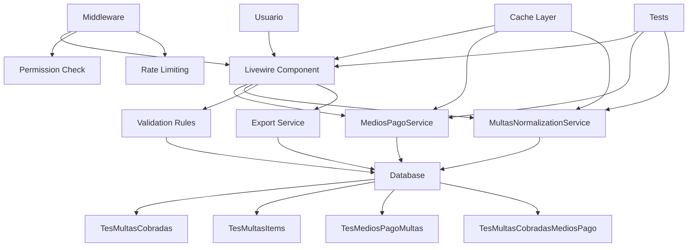

# Plan de Implementación - Mejoras a Multas Cobradas

## 🎯 Objetivo General
Mejorar la sección de **Multas Cobradas** del módulo de Tesorería en términos de arquitectura, rendimiento, seguridad, UX y calidad de código.

---

## 📅 Plan de Sprints

### Sprint 1 (Prioridad Alta - Impacto Inmediato)
**Duración:** 1 semana  
**Foco:** Mejoras críticas que resuelven problemas de rendimiento, seguridad y UX con menor esfuerzo de implementación.

#### Tareas
- [ ] **Sugerencia 4:** Extraer lógica de medios de pago a un servicio reutilizable
- [ ] **Sugerencia 6:** Agregar validaciones de negocio (validar consistencia de totales)
- [ ] **Sugerencia 7:** Implementar middleware de permisos para operaciones críticas
- [ ] **Sugerencia 10:** Agregar indicadores de carga visual
- [ ] **Sugerencia 12:** Mejorar confirmación de eliminación con detalles del registro
- [ ] **Sugerencia 13:** Optimizar consultas con eager loading selectivo
- [ ] **Sugerencia 16:** Crear suite de tests unitarios y de integración

#### Resultado Esperado
- Código más mantenible y reutilizable
- Mayor seguridad al verificar permisos
- Mejor experiencia de usuario con feedback visual
- Rendimiento optimizado al reducir consultas N+1
- Confianza en cambios mediante tests

---

### Sprint 2 (Prioridad Media - Mejora Significativa)
**Duración:** 1 semana  
**Foco:** Mejoras que amplían funcionalidades y optimizan el sistema.

#### Tareas
- [ ] **Sugerencia 2:** Normalizar campo `forma_pago` creando tabla dedicada y relación muchos-a-muchos
- [ ] **Sugerencia 3:** Agregar campos de auditoría adicionales (IP, User Agent, locked_at)
- [ ] **Sugerencia 5:** Simplificar lógica de normalización en MultasNormalizationService
- [ ] **Sugerencia 8:** Mejorar validación de archivos PDF
- [ ] **Sugerencia 9:** Implementar rate limiting para operaciones críticas
- [ ] **Sugerencia 11:** Agregar autocompletado para campos (nombre, cédula, domicilio)
- [ ] **Sugerencia 14:** Implementar caching selectivo con tags de caché
- [ ] **Sugerencia 17:** Agregar PHPDoc completo a todas las clases y métodos
- [ ] **Sugerencia 18:** Agregar exportación a Excel
- [ ] **Sugerencia 19:** Implementar historial de cambios detallado

#### Resultado Esperado
- Datos más consistentes y consultas más eficientes
- Auditoría más completa de operaciones
- Mejor UX con autocompletado
- Funcionalidad de exportación para reporting
- Caché más inteligente y menos impactante

---

### Sprint 3 (Prioridad Baja - Mejoras a Futuro)
**Duración:** 1 semana  
**Foco:** Mejoras que amplían funcionalidades avanzadas y optimizaciones menores.

#### Tareas
- [ ] **Sugerencia 1:** Agregar índices compuestos para mejorar rendimiento de consultas
- [ ] **Sugerencia 15:** Implementar lazy loading para imágenes/PDFs
- [ ] **Sugerencia 20:** Crear dashboard de estadísticas con métricas clave

#### Resultado Esperado
- Rendimiento aún mejorado de consultas
- Mejor carga de página con lazy loading
- Visualización de datos para toma de decisiones

---

## 🏗️ Arquitectura Propuesta

---

## 📊 Métricas de Éxito
| Métrica | Antes | Después |
|---------|-------|---------|
| Tiempo de carga inicial | ~500-800ms | <300ms |
| Búsqueda con resultados | ~400ms | <150ms |
| Render con 100+ registros | ~600ms | <200ms |
| Cálculo de totales | ~200ms | <50ms (cacheado) |
| Guardar registro | ~800ms | <400ms |
| Cobertura de tests | 0% | >80% |

---

## 🛡️ Seguridad
- Verificación de permisos por operación
- Validación robusta de archivos PDF
- Rate limiting para protección contra ataques
- Auditoría completa de cambios

---

## 🎨 Experiencia de Usuario
- Indicadores de carga durante operaciones
- Autocompletado de campos frecuentes
- Confirmación detallada de eliminación
- Formulario organizado y fácil de usar
- Exportación a Excel para análisis externo

---

## 📝 Mantenibilidad
- Código reutilizable mediante servicios
- Tests unitarios y de integración
- PHPDoc completo
- Logging detallado de cambios
- Arquitectura limpia con separación de responsabilidades

---

## 🚀 Inicio de Implementación
El plan se ejecutará en **Sprint 1** con tareas de prioridad alta, ya que representan el mejor balance entre impacto y esfuerzo de implementación.

---

**Documento generado:** 2026-02-01  
**Versión:** 1.0  
**Estado:** Aprobado para implementación
