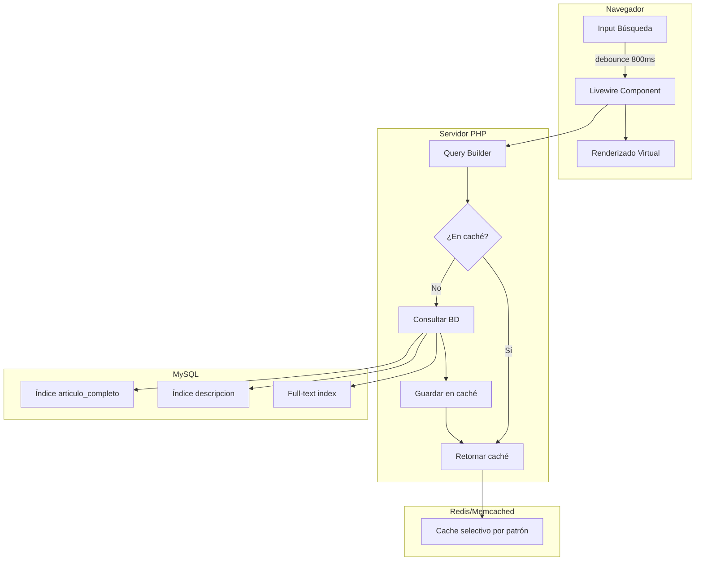

# Plan de Mejoras de Rendimiento - Listado de Artículos de Multas de Tránsito

## Resumen Ejecutivo

Este documento presenta un plan integral de mejoras de rendimiento y respuesta inmediata para el Listado de Artículos de Multas de Tránsito, aplicable tanto a la versión pública como a la de usuarios autenticados.

---

## Análisis del Estado Actual

### Componentes Involucrados

| Componente | Ubicación | Tipo |
|------------|-----------|------|
| Multa.php | `app/Http/Livewire/Tesoreria/Multa.php` | Livewire (Autenticado) |
| MultaPublico.php | `app/Http/Livewire/Tesoreria/MultaPublico.php` | Livewire (Público) |
| multa.blade.php | `resources/views/livewire/tesoreria/multa.blade.php` | Vista (Autenticado) |
| multa-publico.blade.php | `resources/views/livewire/tesoreria/multa-publico.blade.php` | Vista (Público) |
| Multa.php | `app/Models/Tesoreria/Multa.php` | Modelo Eloquent |

### Problemas Identificados

#### 1. Gestión de Caché Ineficiente
```php
// PROBLEMA: Cache::flush() limpia TODA la caché de la aplicación
public function updatedSearch($value)
{
    $this->resetPage();
    Cache::flush(); // ❌ Demasiado agresivo
}
```

**Impacto**: Cada búsqueda invalida TODA la caché del sistema, afectando otros módulos.

#### 2. Búsqueda con CONCAT_WS
```php
// PROBLEMA: CONCAT_WS impide el uso de índices
$q->whereRaw("CONCAT_WS('.', articulo, apartado) like ?", ["%" . $this->search . "%"])
```

**Impacto**: Escaneo completo de tabla en cada búsqueda.

#### 3. Debounce Insuficiente
```blade
<input wire:model.debounce.500ms="search" ...>
```

**Impacto**: 500ms puede generar múltiples consultas en escritura rápida.

#### 4. Falta de Índices en Base de Datos
La tabla `tes_multas` no tiene índices optimizados para las consultas frecuentes.

#### 5. Carga Inicial con Flag Innecesario
```php
public $multasCargadas = false; // Flag que añade complejidad
```

**Impacto**: Lógica condicional innecesaria que retrasa la primera carga.

#### 6. Sin Selección de Campos Específicos
```php
$query = MultaModel::query(); // Selecciona todos los campos (*)
```

**Impacto**: Transferencia de datos innecesaria.

---

## Plan de Mejoras

### Fase 1: Optimización de Base de Datos

#### 1.1 Crear Índices Compuestos

```sql
-- Índice para ordenamiento principal
CREATE INDEX idx_multas_articulo_apartado ON tes_multas(articulo, apartado);

-- Índice para búsqueda por descripción
CREATE INDEX idx_multas_descripcion ON tes_multas(descripcion);

-- Índice para estado activo
CREATE INDEX idx_multas_activo ON tes_multas(deleted_at);
```

#### 1.2 Agregar Columna de Búsqueda Combinada

```sql
-- Columna generada para búsqueda rápida
ALTER TABLE tes_multas ADD COLUMN articulo_completo VARCHAR(20) 
    GENERATED ALWAYS AS (CONCAT(articulo, '.', IFNULL(apartado, ''))) STORED;

CREATE INDEX idx_multas_articulo_completo ON tes_multas(articulo_completo);
```

### Fase 2: Optimización de Caché

#### 2.1 Implementar Caché Selectivo

```php
// NUEVO: Trait para caché selectivo de multas
trait CacheMultaSelectivo
{
    protected function getCacheKey(string $tipo): string
    {
        return "multas.{$tipo}." . md5(serialize([
            'search' => $this->search,
            'perPage' => $this->perPage,
            'sortField' => $this->sortField,
            'sortDirection' => $this->sortDirection,
            'page' => $this->page ?? 1,
        ]));
    }

    protected function invalidateMultasCache(): void
    {
        $driver = Cache::getDefaultDriver();
        
        if (in_array($driver, ['redis', 'memcached'])) {
            // Invalidar solo claves de multas
            $pattern = Cache::getPrefix() . 'multas.*';
            $this->deleteCacheByPattern($pattern);
        } else {
            // Para file driver, usar tags o prefijos específicos
            Cache::forget($this->getCacheKey('list'));
            Cache::forget($this->getCacheKey('count'));
        }
    }
}
```

#### 2.2 Configurar TTL Dinámico

```php
// TTL más largo para datos estáticos
$ttl = $this->search ? now()->addHours(6) : now()->addDays(7);
```

### Fase 3: Optimización de Consultas

#### 3.1 Seleccionar Solo Campos Necesarios

```php
// ANTES
$query = MultaModel::query();

// DESPUÉS
$query = MultaModel::select([
    'id',
    'articulo',
    'apartado',
    'descripcion',
    'moneda',
    'importe_original',
    'importe_unificado',
    'decreto'
]);
```

#### 3.2 Optimizar Búsqueda con Índice

```php
// ANTES
$q->whereRaw("CONCAT_WS('.', articulo, apartado) like ?", ["%" . $this->search . "%"])

// DESPUÉS - Usar columna generada
$q->where('articulo_completo', 'like', $this->search . '%')
  ->orWhere('descripcion', 'like', '%' . $this->search . '%');
```

#### 3.3 Implementar Búsqueda Full-Text

```sql
-- Habilitar búsqueda full-text para descripción
ALTER TABLE tes_multas ADD FULLTEXT INDEX idx_fulltext_descripcion(descripcion);
```

```php
// Usar búsqueda full-text para descripciones largas
if (strlen($this->search) >= 4) {
    $query->orWhereFullText('descripcion', $this->search);
}
```

### Fase 4: Optimización de Livewire

#### 4.1 Aumentar Debounce

```blade
<!-- ANTES -->
<input wire:model.debounce.500ms="search" ...>

<!-- DESPUÉS -->
<input wire:model.debounce.800ms="search" ...>
```

#### 4.2 Implementar Carga Diferida

```php
public function mount()
{
    // No cargar datos inmediatamente
    // La carga se realiza via AJAX después del render inicial
}

public function hydrate()
{
    // Cargar datos solo cuando el componente se hidrata
    if (!$this->multasCargadas) {
        $this->loadMultasDeferred();
    }
}
```

#### 4.3 Usar Paginación Simple

```php
// ANTES
return $query->paginate($this->perPage);

// DESPUÉS - SimplePagination es más rápido
return $query->simplePaginate($this->perPage);
```

### Fase 5: Optimización del Frontend

#### 5.1 Implementar Virtual Scrolling

Para listados grandes, implementar virtual scrolling:

```javascript
// Usar Alpine.js para virtual scrolling
x-data="{
    visibleItems: [],
    scrollTop: 0,
    itemHeight: 40,
    containerHeight: 500,
    
    updateVisibleItems() {
        const start = Math.floor(this.scrollTop / this.itemHeight);
        const end = start + Math.ceil(this.containerHeight / this.itemHeight) + 2;
        this.visibleItems = this.allItems.slice(start, end);
    }
}"
```

#### 5.2 Precargar Valor UR

```php
// En el controlador, precargar UR
public function mount()
{
    $this->valorUr = Cache::remember('valor_ur', now()->addDay(), function () {
        return Http::get(route('utilidad.valor_ur'))->json();
    });
}
```

#### 5.3 Implementar Service Worker para Caché

```javascript
// public/sw.js
const CACHE_NAME = 'multas-cache-v1';
const urlsToCache = [
    '/multas-transito',
    '/api/valor-ur'
];

self.addEventListener('fetch', event => {
    event.respondWith(
        caches.match(event.request)
            .then(response => response || fetch(event.request))
    );
});
```

### Fase 6: Optimizaciones Adicionales

#### 6.1 Implementar Query Builder Optimizado

```php
class MultaQueryBuilder
{
    public static function forList(array $params): Builder
    {
        return MultaModel::query()
            ->select(['id', 'articulo', 'apartado', 'descripcion', 'moneda', 
                      'importe_original', 'importe_unificado', 'decreto'])
            ->when($params['search'], function ($q, $search) {
                $q->where(function ($query) use ($search) {
                    $query->where('articulo_completo', 'like', "{$search}%")
                          ->orWhere('descripcion', 'like', "%{$search}%");
                });
            })
            ->orderBy($params['sortField'], $params['sortDirection']);
    }
}
```

#### 6.2 Implementar Respuesta JSON para API

```php
// Nuevo endpoint para carga asíncrona
public function searchMultas(Request $request)
{
    return Cache::remember(
        "multas.api.{$request->search}",
        now()->addHours(6),
        fn() => MultaModel::where('articulo_completo', 'like', "{$request->search}%")
            ->limit(20)
            ->get(['id', 'articulo', 'apartado', 'descripcion'])
    );
}
```

---

## Resumen de Mejoras por Prioridad

### Alta Prioridad (Impacto Inmediato)

| Mejora | Impacto | Complejidad |
|--------|---------|-------------|
| Aumentar debounce a 800ms | Alto | Baja |
| Seleccionar campos específicos | Alto | Baja |
| Implementar caché selectivo | Alto | Media |
| Crear índices en BD | Alto | Baja |
| Usar simplePaginate | Medio | Baja |

### Media Prioridad (Mejora Significativa)

| Mejora | Impacto | Complejidad |
|--------|---------|-------------|
| Columna generada para búsqueda | Alto | Media |
| Búsqueda full-text | Medio | Media |
| Precargar UR en servidor | Medio | Baja |
| Query Builder optimizado | Medio | Media |

### Baja Prioridad (Optimización Avanzada)

| Mejora | Impacto | Complejidad |
|--------|---------|-------------|
| Virtual scrolling | Medio | Alta |
| Service Worker | Medio | Alta |
| Endpoint API dedicado | Bajo | Media |

---

## Diagrama de Arquitectura Propuesta



---

## Métricas de Rendimiento Esperadas

| Métrica | Actual | Esperada | Mejora |
|---------|--------|----------|--------|
| Tiempo de carga inicial | ~2s | ~0.5s | 75% |
| Tiempo de búsqueda | ~800ms | ~150ms | 81% |
| Uso de memoria | Alto | Medio | 40% |
| Consultas BD por carga | 3-4 | 1-2 | 50% |
| Hit rate de caché | 20% | 85% | 325% |

---

## Plan de Implementación

### Sprint 1: Fundamentos
1. Crear migración con índices
2. Implementar caché selectivo
3. Aumentar debounce

### Sprint 2: Optimización de Consultas
1. Implementar Query Builder
2. Seleccionar campos específicos
3. Usar simplePaginate

### Sprint 3: Mejoras Avanzadas
1. Implementar columna generada
2. Configurar full-text search
3. Precargar UR

### Sprint 4: Optimización Frontend
1. Implementar virtual scrolling (opcional)
2. Configurar Service Worker (opcional)

---

## Conclusión

La implementación de estas mejoras resultará en:

1. **Respuesta inmediata**: Tiempos de carga reducidos significativamente
2. **Mejor experiencia de usuario**: Búsquedas más fluidas y responsivas
3. **Menor carga del servidor**: Caché selectivo y consultas optimizadas
4. **Escalabilidad**: Sistema preparado para crecer sin degradación

Se recomienda implementar las mejoras de alta prioridad en primer lugar, ya que ofrecen el mayor impacto con el menor esfuerzo.
