# Propuesta de Mejora: Modal de Detalle de Multas Cobradas

## Análisis del Diseño Actual

### Problemas Identificados

1. **Header excesivamente elaborado**
   - Gradiente, sombras de texto y elementos decorativos que añaden ruido visual
   - Icono circular con fondo blanco que rompe la continuidad

2. **Espacio desperdiciado**
   - Múltiples cards separadas con padding excesivo
   - El monto total ocupa una card completa de 4 columnas
   - Información dispersa que obliga a escanear toda la pantalla

3. **Jerarquía visual confusa**
   - Demasiados elementos compitiendo por atención
   - Colores y badges que no siguen una jerarquía clara
   - Información de auditoría con demasiado protagonismo

4. **Inconsistencia en estilos**
   - Mezcla de estilos inline y clases Bootstrap
   - Sombras y bordes que no aportan valor funcional

---

## Propuesta de Nuevo Diseño

### Filosofía de Diseño

- **Minimalista**: Eliminar elementos decorativos innecesarios
- **Compacto**: Aprovechar cada milímetro del espacio
- **Jerárquico**: Información importante primero, secundaria después
- **Profesional**: Estilo de documento fiscal/recibo oficial

### Estructura Propuesta

```
┌─────────────────────────────────────────────────────────────────────┐
│ HEADER COMPACTO                                                     │
│ Recibo: A-1234  │  Fecha: 14/02/2026                         [X]    │
├─────────────────────────────────────────────────────────────────────┤
│ ╔═══════════════════════════════════════════════════════════════╗   │
│ ║                    TOTAL: $ 15.000,00                         ║   │
│ ║              ────────────────────────                         ║   │
│ ║              Efectivo: $5.000 | Tarjeta: $10.000              ║   │
│ ╚═══════════════════════════════════════════════════════════════╝   │
├─────────────────────────────────────────────────────────────────────┤
│ CONTRIBUYENTE                                                       │
│ Juan Pérez Martínez          │  CI: 1.234.567-8                     │
│ Domicilio: Av. Principal 123 │  Tel: 099 123 456                   │
├─────────────────────────────────────────────────────────────────────┤
│ DESGLOSE DE CONCEPTOS                                               │
│ ┌────────────────────────────────────────────┬──────────────┐      │
│ │ CONCEPTO                          │ DESC   │ IMPORTE      │      │
│ ├────────────────────────────────────────────┼──────────────┤      │
│ │ Multa por infracción de tránsito  │ Art 42 │ $ 5.000,00   │      │
│ │ Multa por estacionamiento indebido│ -      │ $ 10.000,00  │      │
│ └────────────────────────────────────────────┴──────────────┘      │
├─────────────────────────────────────────────────────────────────────┤
│ OBSERVACIONES                                                       │
│ Matrícula ABC 1234 - Boleta de pago verificada                     │
├─────────────────────────────────────────────────────────────────────┤
│ Registrado por: Usuario Admin · 14/02/2026 10:30    [Editar][Imprimir]│
└─────────────────────────────────────────────────────────────────────┘
```

### Especificaciones Técnicas con Bootstrap 4.6

#### 1. Header Compacto

```html
<div class="modal-header bg-dark text-white py-2 px-3">
    <div class="d-flex align-items-center w-100 justify-content-between">
        <div class="d-flex align-items-center">
            <span class="badge badge-light mr-2">{{ $selectedRegistro->recibo }}</span>
            <span class="text-light small">{{ $selectedRegistro->fecha->format('d/m/Y') }}</span>
        </div>
    </div>
</div>
```

#### 2. Sección Destacada de Monto Total (NUEVA)

```html
<div class="bg-success text-white text-center py-3">
    <div class="small text-uppercase opacity-75 mb-1">Monto Total Cobrado</div>
    <div class="h2 font-weight-bold mb-2">{{ $selectedRegistro->monto_formateado }}</div>
    <div class="d-flex justify-content-center flex-wrap small">
        @foreach(explode('/', $selectedRegistro->forma_pago) as $medio)
        <span class="badge badge-light text-dark mr-1 mb-1">{{ $medio }}</span>
        @endforeach
    </div>
</div>
```

#### 3. Sección de Contribuyente

```html
<div class="border-bottom py-2 px-3 bg-light">
    <div class="row small">
        <div class="col-md-6">
            <span class="text-muted">Nombre:</span>
            <strong>{{ $selectedRegistro->nombre }}</strong>
        </div>
        <div class="col-md-3">
            <span class="text-muted">CI:</span>
            <strong>{{ $selectedRegistro->cedula }}</strong>
        </div>
        <div class="col-md-3">
            <span class="text-muted">Tel:</span>
            <strong>{{ $selectedRegistro->temp_tel }}</strong>
        </div>
    </div>
    <div class="row small mt-1">
        <div class="col-12">
            <span class="text-muted">Domicilio:</span>
            <span>{{ $selectedRegistro->domicilio }}</span>
        </div>
    </div>
</div>
```

#### 4. Tabla de Conceptos

```html
<div class="p-0">
    <table class="table table-sm table-borderless mb-0 small">
        <thead class="border-bottom">
            <tr class="text-muted">
                <th class="border-0 py-1">CONCEPTO</th>
                <th class="border-0 py-1" style="width: 120px;">DESCRIPCIÓN</th>
                <th class="border-0 py-1 text-right" style="width: 100px;">IMPORTE</th>
            </tr>
        </thead>
        <tbody>
            @foreach($selectedRegistro->items as $item)
            <tr>
                <td class="py-1">{{ $item->detalle }}</td>
                <td class="py-1 text-muted">{{ $item->descripcion ?: '-' }}</td>
                <td class="py-1 text-right font-weight-bold">$ {{ number_format($item->importe, 2, ',', '.') }}</td>
            </tr>
            @endforeach
        </tbody>
    </table>
</div>
```

#### 5. Sección de Observaciones

```html
<div class="border-top py-2 px-3">
    <div class="small text-muted text-uppercase mb-1">Observaciones</div>
    <div class="small">{{ $selectedRegistro->adenda ?: 'Sin observaciones' }}</div>
</div>
```

#### 6. Footer Minimalista

```html
<div class="modal-footer py-2 px-3 bg-light border-top">
    <small class="text-muted mr-auto">
        <i class="fas fa-user-edit"></i> {{ $selectedRegistro->creator->nombre }} · {{ $selectedRegistro->created_at->format('d/m/Y H:i') }}
    </small>
    <div class="btn-group btn-group-sm">
        <button class="btn btn-outline-secondary" onclick="window.print()">
            <i class="fas fa-print"></i>
        </button>
        <button class="btn btn-primary" @click="editFromDetail">
            <i class="fas fa-edit mr-1"></i> Editar
        </button>
    </div>
</div>
```

---

## Mejoras Clave

| Aspecto | Antes | Después |
|---------|-------|---------|
| Header | Gradiente elaborado con iconos | Fila compacta con recibo y fecha |
| Monto Total | Card separada de 4 columnas | **Sección destacada con fondo verde, tamaño grande** |
| Medios de Pago | Card separada | **Integrados debajo del monto total** |
| Contribuyente | Card con padding excesivo | Dos filas compactas con datos |
| Tabla | Con bordes y striped | Borderless, limpia y profesional |
| Observaciones | Card con icono grande | Fila simple integrada |
| Auditoría | Card completa | Texto pequeño en footer |
| Footer | Botones grandes | Botones compactos |

---

## Diagrama de Flujo Visual

```mermaid
flowchart TB
    subgraph Actual
        A1[Header Gradiente] --> A2[Card Monto Total]
        A2 --> A3[Card Contribuyente]
        A3 --> A4[Card Conceptos]
        A4 --> A5[Card Pago]
        A5 --> A6[Card Observaciones]
        A6 --> A7[Card Auditoría]
        A7 --> A8[Footer]
    end
    
    subgraph Propuesto
        B1[Header Compacto con Total] --> B2[Fila Contribuyente]
        B2 --> B3[Tabla Conceptos]
        B3 --> B4[Columna Pago + Columna Obs]
        B4 --> B5[Footer con Auditoría]
    end
```



---

## Beneficios Esperados

1. **Ahorro de espacio vertical**: ~40% menos altura del modal
2. **Lectura más rápida**: Información clave visible sin scroll
3. **Aspecto profesional**: Similar a documentos fiscales oficiales
4. **Consistencia**: Uso exclusivo de clases Bootstrap 4.6
5. **Mantenibilidad**: Menos CSS personalizado, más utilidades estándar

---

## Próximos Pasos

1. Revisar y aprobar esta propuesta
2. Implementar el nuevo diseño en el archivo blade
3. Probar en diferentes resoluciones de pantalla
4. Ajustar detalles según feedback
